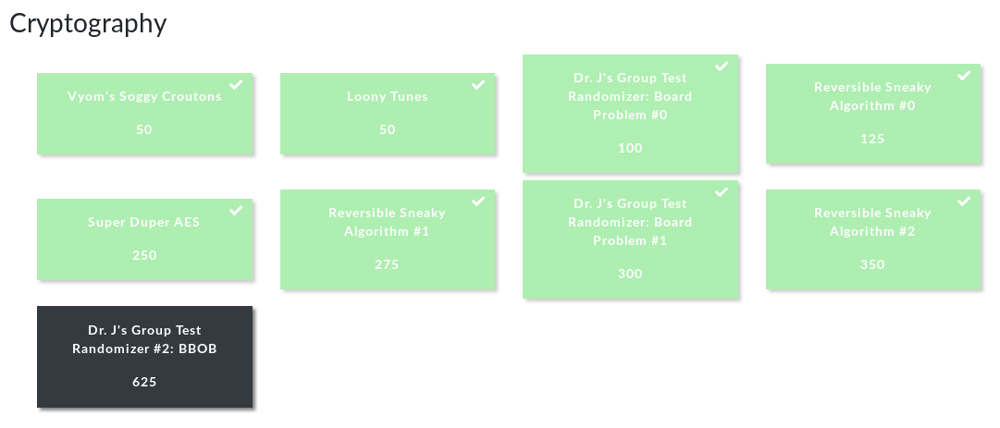

CHALLENGE | POINTS | TAGS
--- | --- | ---
Vyom's Soggy Croutons | 50 pts | ROT9
Loony Tunes | 50 pts | Pigpen Cipher
Dr. J's Group Test Randomizer: Board Problem #0 | 100 pts | Middle Square, PRNG
Reversible Sneaky Algorithm #0 | 125 pts | RSA
Super Duper AES | 250 pts | Subtitution-Permutation Cipher, Block Cipher
Reversible Sneaky Algorithm #1 | 275 pts | RSA
Dr. J's Group Test Randomizer: Board Problem #1 | 300 pts | Middle Square, PRNG
Reversible Sneaky Algorithm #2 | 350 pts | RSA
Dr. J's Group Test Randomizer #2: BBOB | 625 pts | Middle Square, Weyl Sequence, PRNG

