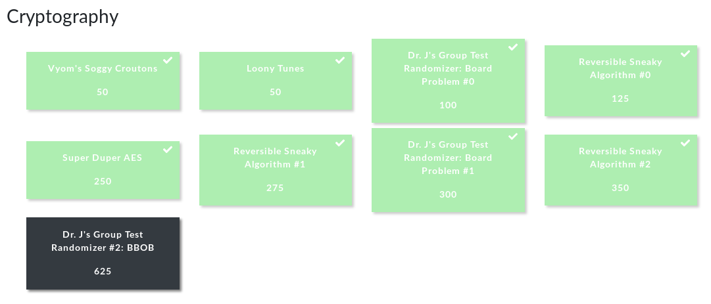

## CHALLENGE LIST

CHALLENGE | POINTS | CATEGORY | TAGS
--- | --- | --- | ---
Vyom's Soggy Croutons | 50 pts | Crypto | ROT9
Loony Tunes | 50 pts | Crypto | Pigpen Cipher
[Dr. J's Group Test Randomizer: Board Problem #0](./Crypto_3_Group_Test_Randomizer_0.md) | 100 pts | Crypto | Middle Square, PRNG
[Reversible Sneaky Algorithm #0](./Crypto_4_Reversible_Sneaky_Algorithm_0.md) | 125 pts | Crypto | RSA
[Super Duper AES](./Crypto_5_Super_Duper_AES.md) | 250 pts | Crypto | Subtitution-Permutation Cipher, Block Cipher
[Reversible Sneaky Algorithm #1](./Crypto_6_Reversible_Sneaky_Algorithm_1.md) | 275 pts | Crypto | RSA
[Dr. J's Group Test Randomizer: Board Problem #1](./Crypto_7_Group_Test_Randomizer_1.md) | 300 pts | Crypto | Middle Square, PRNG
[Reversible Sneaky Algorithm #2](./Crypto_8_Reversible_Sneaky_Algorithm_2.md) | 350 pts | Crypto | RSA
Dr. J's Group Test Randomizer #2: BBOB | 625 pts | Crypto | Middle Square, Weyl Sequence, PRNG

## CHALLENGE BOARD

